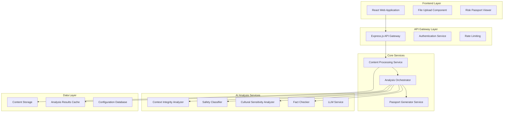
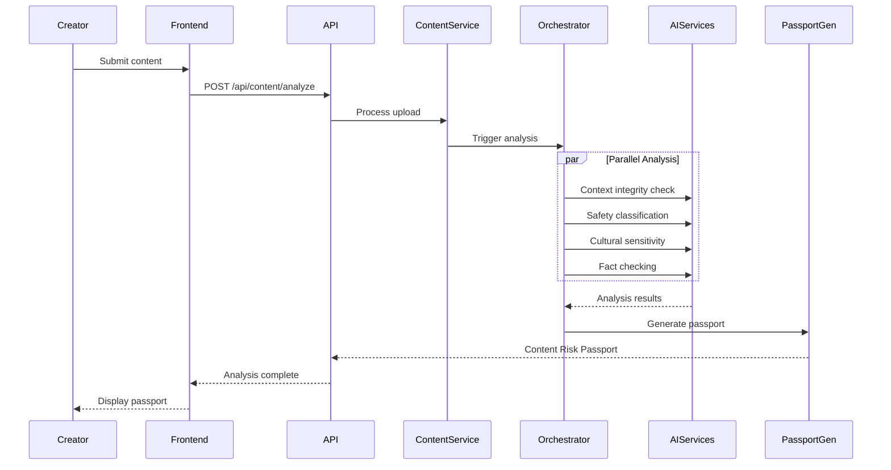

# Design Document: INTEGRI

## Overview

INTEGRI is a web-based AI platform that provides comprehensive content verification and risk assessment for digital content creators in India. The system analyzes submitted content (text or video with captions) through multiple AI components and generates a visual "Content Risk Passport" that explains potential risks without censoring creativity.

The platform follows a microservices architecture with a React-based frontend, Node.js/Express backend API, and specialized AI analysis services. The system emphasizes explainable AI principles, ensuring every assessment includes transparent reasoning and educational context.

## Architecture

### High-Level Architecture



### Service Responsibilities

**Frontend Layer:**
- Content submission interface with drag-and-drop support
- Real-time progress tracking during analysis
- Interactive Content Risk Passport visualization
- Creator mode switching (Beginner/Advanced)
- PDF/image export functionality

**API Gateway:**
- Request routing and load balancing
- Authentication and session management
- Rate limiting and abuse prevention
- Request/response logging and monitoring

**Content Processing Service:**
- File upload handling and validation
- Content format conversion and preprocessing
- Temporary storage management with automatic cleanup
- Content metadata extraction

**Analysis Orchestrator:**
- Coordinates multiple AI analysis services
- Manages analysis workflow and dependencies
- Aggregates results from individual analyzers
- Implements timeout and retry logic

**AI Analysis Services:**
- Independent, specialized analysis components
- Stateless design for horizontal scaling
- Standardized input/output interfaces
- Confidence scoring and uncertainty handling

## Components and Interfaces

### Content Processing Pipeline



### Core Interfaces

**Content Submission Interface:**
```typescript
interface ContentSubmission {
  contentType: 'text' | 'video';
  content: string | File;
  caption?: string;
  creatorMode: 'beginner' | 'advanced';
  language: 'hindi' | 'english';
}
```

**Analysis Result Interface:**
```typescript
interface AnalysisResult {
  componentName: string;
  confidence: number; // 0-100
  riskScore: number; // 0-100
  findings: Finding[];
  reasoning: string[];
  references: Reference[];
}

interface Finding {
  category: string;
  severity: 'low' | 'medium' | 'high' | 'critical';
  description: string;
  evidence: string[];
  suggestions: string[];
}
```

**Content Risk Passport Interface:**
```typescript
interface ContentRiskPassport {
  overallRiskLevel: 'low' | 'medium' | 'high' | 'critical';
  ageAppropriateness: AgeAssessment;
  culturalSensitivity: CulturalAssessment;
  factualCredibility: FactualAssessment;
  safetyIndicators: SafetyAssessment;
  contextIntegrity: ContextAssessment;
  platformRisks: PlatformRiskAssessment;
  interventionRecommendation: InterventionRecommendation;
  generatedAt: Date;
  analysisId: string;
}
```

### AI Service Interfaces

**Context Integrity Analyzer:**
- Analyzes video scene transitions and temporal consistency
- Compares speech-to-text with provided captions
- Detects potential out-of-context footage reuse
- Identifies timeline inconsistencies in merged clips

**Safety Classifier:**
- Psychological harm detection (anxiety, depression, self-harm triggers)
- Social harm identification (hate speech, discrimination, violence)
- Content appropriateness scoring across age groups
- Harm severity classification with confidence levels

**Cultural Sensitivity Analyzer:**
- Indian cultural context evaluation
- Regional sensitivity assessment across major Indian states
- Religious and community sensitivity scoring
- Festival, tradition, and custom appropriateness checking

**Fact Checker:**
- Claim extraction from text and speech content
- Factual verification against trusted Indian sources
- Confidence scoring with supporting evidence
- Source credibility assessment and citation

## Data Models

### Content Storage Model

```typescript
interface StoredContent {
  contentId: string;
  contentType: 'text' | 'video';
  originalFilename?: string;
  fileSize?: number;
  mimeType?: string;
  textContent?: string;
  extractedCaption?: string;
  uploadedAt: Date;
  creatorSessionId: string;
  processingStatus: 'uploaded' | 'processing' | 'completed' | 'failed';
  retentionExpiry: Date; // Auto-delete after analysis
}
```

### Analysis Results Model

```typescript
interface AnalysisSession {
  sessionId: string;
  contentId: string;
  creatorMode: 'beginner' | 'advanced';
  language: 'hindi' | 'english';
  startedAt: Date;
  completedAt?: Date;
  status: 'pending' | 'analyzing' | 'completed' | 'failed';
  
  // Individual component results
  contextIntegrityResult?: AnalysisResult;
  safetyClassificationResult?: AnalysisResult;
  culturalSensitivityResult?: AnalysisResult;
  factCheckingResult?: AnalysisResult;
  
  // Aggregated results
  overallRiskLevel?: 'low' | 'medium' | 'high' | 'critical';
  riskPassport?: ContentRiskPassport;
  
  // Error handling
  errors: AnalysisError[];
  retryCount: number;
}
```

### Configuration Model

```typescript
interface AnalysisConfiguration {
  riskThresholds: {
    lowToMedium: number;
    mediumToHigh: number;
    highToCritical: number;
  };
  
  componentWeights: {
    contextIntegrity: number;
    safetyClassification: number;
    culturalSensitivity: number;
    factualCredibility: number;
  };
  
  interventionRules: {
    lowRisk: InterventionRule;
    mediumRisk: InterventionRule;
    highRisk: InterventionRule;
    criticalRisk: InterventionRule;
  };
  
  culturalContext: {
    region: string;
    festivals: string[];
    sensitivities: string[];
    languages: string[];
  };
}
```

### User Session Model

```typescript
interface CreatorSession {
  sessionId: string;
  createdAt: Date;
  lastActiveAt: Date;
  creatorMode: 'beginner' | 'advanced';
  preferredLanguage: 'hindi' | 'english';
  submissionCount: number;
  analysisHistory: string[]; // Analysis session IDs
}
```

## Correctness Properties

*A property is a characteristic or behavior that should hold true across all valid executions of a system—essentially, a formal statement about what the system should do. Properties serve as the bridge between human-readable specifications and machine-verifiable correctness guarantees.*

### Property 1: Content Risk Passport Completeness
*For any* valid content submission, the generated Content Risk Passport should contain all required components: overall risk level (Low/Medium/High/Critical), age appropriateness assessment, cultural sensitivity analysis, factual credibility score with references, psychological and social harm indicators, platform risk likelihood, and explainable AI reasoning for each score.
**Validates: Requirements 1.2, 1.3, 1.4, 1.5, 1.6, 1.7, 1.8**

### Property 2: Analysis Performance Guarantee
*For any* content submission under system limits (text ≤10,000 chars, video ≤100MB), the system should generate a complete Content Risk Passport within 30 seconds.
**Validates: Requirements 1.1**

### Property 3: Context Integrity Detection
*For any* video content with multiple scenes or merged clips, the Context Integrity Analyzer should detect and flag potential narrative mismatches, timeline inconsistencies, and provide specific explanations when misleading context is identified.
**Validates: Requirements 2.1, 2.4, 2.5**

### Property 4: Speech-Caption Consistency Verification
*For any* video content with both speech and captions, the Context Integrity Analyzer should compare speech-to-text with provided captions and flag inconsistencies with confidence scores between 0-100.
**Validates: Requirements 2.2, 2.6**

### Property 5: Archived Content Detection
*For any* content that reuses old or archived footage, the Context Integrity Analyzer should flag potential out-of-context usage and provide explanations for the detection.
**Validates: Requirements 2.3**

### Property 6: Risk-Based Intervention Logic
*For any* analyzed content, the Intervention Engine should apply appropriate recommendations based on risk level: Low (allow publishing), Medium (warnings + suggestions), High (restricted sharing + disclaimers), Critical (block + alternatives with minimum 3 suggestions).
**Validates: Requirements 3.1, 3.2, 3.3, 3.4, 3.6**

### Property 7: Creator Mode Adaptation
*For any* creator session, when Beginner mode is selected, the system should provide detailed explanations and educational tooltips, while Advanced mode should provide condensed information with expandable details and style-preserving suggestions.
**Validates: Requirements 4.1, 4.2, 4.4, 4.5**

### Property 8: Mode Switching Flexibility
*For any* active creator session, the system should allow switching between Beginner and Advanced modes at any time without losing session state.
**Validates: Requirements 4.3**

### Property 9: Input Validation and Format Support
*For any* content submission, the system should accept valid formats (text ≤10,000 chars, video ≤100MB in MP4/AVI/MOV) and reject invalid formats with descriptive error messages.
**Validates: Requirements 5.1, 5.2, 5.5**

### Property 10: Language Processing Support
*For any* content in Hindi or English, the system should successfully process and analyze the content, including caption extraction from video submissions.
**Validates: Requirements 5.3, 5.4**

### Property 11: Content Privacy and Cleanup
*For any* submitted content, the system should automatically delete files after analysis completion to maintain privacy.
**Validates: Requirements 5.6**

### Property 12: Safety Classification Comprehensiveness
*For any* content, the Safety Classifier should identify and score both psychological harm indicators (anxiety triggers, depression content, self-harm references) and social harm indicators (hate speech, discrimination, violence promotion).
**Validates: Requirements 6.1, 6.2**

### Property 13: Cultural Sensitivity Analysis
*For any* content, the Cultural Sensitivity Analyzer should evaluate content against Indian cultural norms and regional sensitivities, providing context-appropriate assessments.
**Validates: Requirements 6.3**

### Property 14: Fact Checking with References
*For any* content containing factual claims, the Fact Checker should verify claims and provide confidence scores with supporting source references.
**Validates: Requirements 6.4**

### Property 15: Score Aggregation Consistency
*For any* content analysis, the system should combine individual AI component scores into an overall Risk Level using consistent weighted algorithms.
**Validates: Requirements 6.5**

### Property 16: Uncertainty Handling
*For any* AI analysis with low confidence, the system should indicate confidence levels and trigger human review requests for edge cases.
**Validates: Requirements 6.6**

### Property 17: Comprehensive Explainability
*For any* AI assessment or recommendation, the system should provide specific explanations, reasoning chains, highlight contributing content elements, and cite relevant guidelines or research.
**Validates: Requirements 7.1, 7.2, 7.3, 7.6**

### Property 18: Educational Context Provision
*For any* identified risk pattern, the system should provide educational context explaining why the pattern is considered risky.
**Validates: Requirements 7.4**

### Property 19: Interactive Explanation Interface
*For any* Content Risk Passport, clickable explanations should expand to show detailed AI reasoning.
**Validates: Requirements 7.5**

### Property 20: Responsive Interface Functionality
*For any* device type (desktop or mobile), the web interface should be responsive and provide drag-and-drop file upload functionality.
**Validates: Requirements 8.1, 8.3**

### Property 21: Passport Export and Sharing
*For any* generated Content Risk Passport, the system should display it as a visually appealing artifact and allow download in PDF or image format.
**Validates: Requirements 8.4, 8.5**

### Property 22: Real-time Progress and Session Management
*For any* content analysis session, the system should provide real-time progress indicators and maintain session state allowing multiple submissions per session.
**Validates: Requirements 8.6, 8.7**

## Error Handling

### Content Processing Errors

**File Upload Failures:**
- Invalid file formats trigger descriptive error messages
- File size exceeding limits (100MB for video, 10,000 chars for text) returns specific size violation errors
- Corrupted files are detected and rejected with appropriate messaging
- Network interruptions during upload trigger retry mechanisms with exponential backoff

**Content Analysis Failures:**
- Individual AI service failures don't block entire analysis - partial results are provided with clear indicators of missing components
- Timeout handling for long-running analysis with graceful degradation
- Language detection failures default to English processing with user notification
- Caption extraction failures for video content proceed with video-only analysis

### AI Service Error Handling

**Service Unavailability:**
- Circuit breaker pattern prevents cascading failures
- Fallback to cached results when available
- Queue-based retry system for transient failures
- User notification of service degradation with estimated recovery time

**Analysis Confidence Issues:**
- Low confidence scores trigger human review workflows
- Uncertain results are clearly marked in the Content Risk Passport
- Multiple analysis attempts with different parameters for edge cases
- Escalation paths for content that cannot be reliably analyzed

### User Experience Error Recovery

**Session Management:**
- Automatic session recovery after network disconnections
- Progress preservation during browser refresh or navigation
- Clear error messaging with actionable next steps
- Graceful degradation when non-critical features fail

**Data Integrity:**
- Validation of all user inputs before processing
- Sanitization of uploaded content to prevent security issues
- Backup analysis results to prevent data loss
- Audit trails for all analysis decisions and user interactions

## Testing Strategy

### Dual Testing Approach

The INTEGRI system requires comprehensive testing through both unit tests and property-based tests to ensure correctness across all scenarios:

**Unit Tests:**
- Focus on specific examples and edge cases for each AI component
- Test integration points between services
- Validate error conditions and recovery mechanisms
- Test specific cultural sensitivity scenarios relevant to Indian context
- Verify exact behavior for known problematic content patterns

**Property-Based Tests:**
- Verify universal properties across all possible inputs
- Test system behavior with randomly generated content
- Validate consistency of risk scoring algorithms
- Ensure explainability requirements are met for all analysis results
- Test performance guarantees across varying content sizes and types

### Property-Based Testing Configuration

**Testing Framework:** Use fast-check for JavaScript/TypeScript property-based testing
**Test Configuration:**
- Minimum 100 iterations per property test to ensure comprehensive coverage
- Each property test must reference its corresponding design document property
- Tag format: **Feature: integri, Property {number}: {property_text}**

**Example Property Test Structure:**
```typescript
// Feature: integri, Property 1: Content Risk Passport Completeness
test('Content Risk Passport contains all required components', () => {
  fc.assert(fc.property(
    contentGenerator(), // Generates random valid content
    async (content) => {
      const passport = await analyzeContent(content);
      expect(passport.overallRiskLevel).toBeOneOf(['low', 'medium', 'high', 'critical']);
      expect(passport.ageAppropriateness).toBeDefined();
      expect(passport.culturalSensitivity).toBeDefined();
      expect(passport.factualCredibility).toBeDefined();
      expect(passport.safetyIndicators).toBeDefined();
      expect(passport.platformRisks).toBeDefined();
      expect(passport.explainableReasoning).toBeDefined();
    }
  ), { numRuns: 100 });
});
```

### Testing Data and Scenarios

**Content Generation for Testing:**
- Random text generation in Hindi and English
- Synthetic video content with various scene combinations
- Edge cases: empty content, maximum size content, special characters
- Cultural context variations: different Indian regions, festivals, traditions
- Fact-checking scenarios: verifiable claims, false claims, ambiguous statements

**Performance Testing:**
- Load testing with concurrent content submissions
- Stress testing with maximum file sizes
- Response time validation under various system loads
- Memory usage monitoring during large content processing

### Integration Testing

**End-to-End Workflows:**
- Complete content submission to passport generation flows
- Creator mode switching during active sessions
- Export functionality for generated passports
- Error recovery and retry mechanisms

**Service Integration:**
- AI service coordination and result aggregation
- Database consistency during concurrent operations
- Cache invalidation and refresh strategies
- Authentication and session management across services
