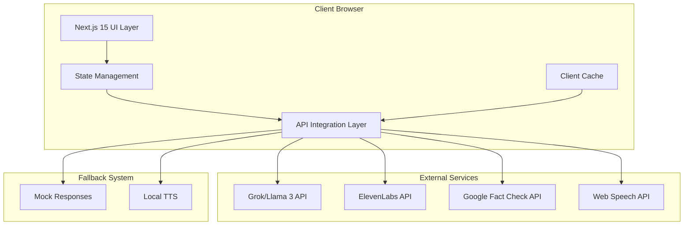
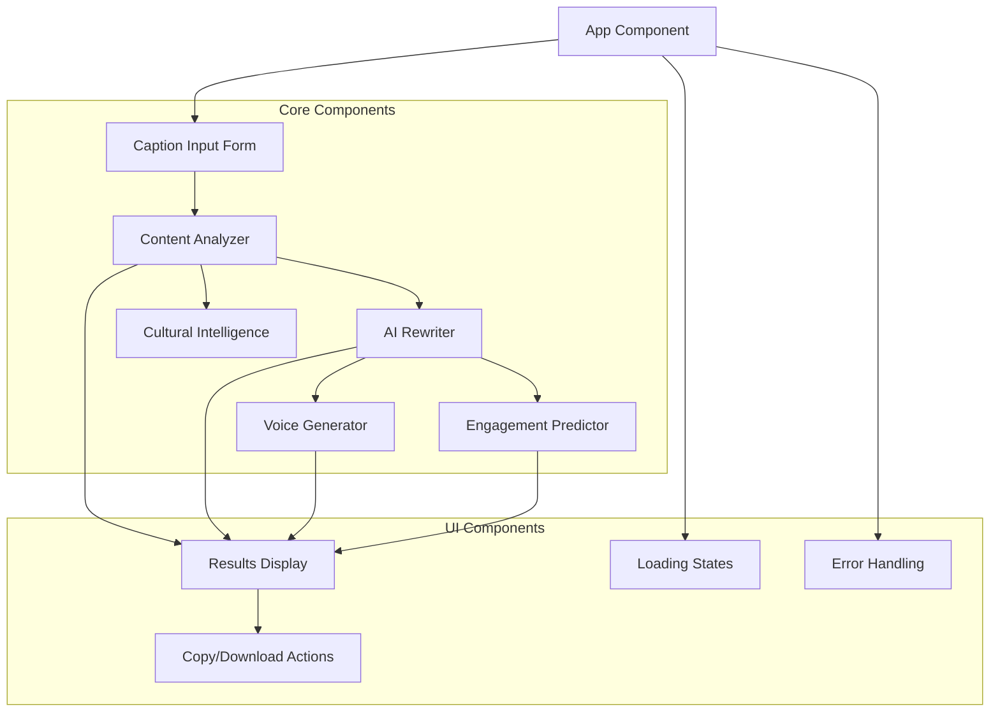

# Design Document: ReelSafe AI

## Overview

ReelSafe AI is a client-side web application built with Next.js 15, shadcn/ui, and Tailwind CSS that provides instant AI-powered content analysis and optimization for Indian digital creators. The system processes user captions through a three-step workflow: content analysis with color-coded safety assessment, AI-powered rewriting with cultural intelligence, and voice generation with engagement prediction.

The architecture follows a frontend-only approach with direct API integrations to external services (LLM APIs, TTS services, fact-checking APIs) while maintaining graceful fallbacks for demo reliability. All processing happens client-side with no persistent data storage, ensuring privacy and rapid deployment.

## Architecture

### System Architecture



### Component Architecture



## Components and Interfaces

### Core Components

#### ContentAnalyzer Component
**Purpose**: Analyzes caption content and assigns safety color codes
**Inputs**: 
- `caption: string` - User-provided caption text
- `ageGroup: '10-13' | '14-17' | '18+'` - Target age demographic
- `language: 'hindi' | 'english'` - Content language

**Outputs**:
- `safetyScore: 'GREEN' | 'YELLOW' | 'RED'` - Color-coded safety assessment
- `explanation: string` - Human-readable explanation of the assessment
- `suggestions: string[]` - Specific improvement recommendations

**Interface**:
```typescript
interface AnalysisResult {
  safetyScore: 'GREEN' | 'YELLOW' | 'RED';
  explanation: string;
  suggestions: string[];
  confidence: number;
  processingTime: number;
}

interface ContentAnalyzer {
  analyze(caption: string, ageGroup: AgeGroup, language: Language): Promise<AnalysisResult>;
}
```

#### AIRewriter Component
**Purpose**: Generates optimized caption rewrites based on analysis results
**Inputs**:
- `originalCaption: string` - Original user caption
- `analysisResult: AnalysisResult` - Results from content analysis
- `culturalContext: CulturalContext` - Indian cultural intelligence data

**Outputs**:
- `rewrittenCaption: string` - AI-optimized caption
- `improvements: string[]` - List of applied improvements
- `hashtags: string[]` - Culturally relevant hashtags

**Interface**:
```typescript
interface RewriteResult {
  rewrittenCaption: string;
  improvements: string[];
  hashtags: string[];
  culturalEnhancements: string[];
}

interface AIRewriter {
  rewrite(caption: string, analysis: AnalysisResult, cultural: CulturalContext): Promise<RewriteResult>;
}
```

#### VoiceGenerator Component
**Purpose**: Converts final caption to downloadable audio
**Inputs**:
- `text: string` - Final caption text for voice generation
- `language: 'hindi' | 'english'` - Target language for speech
- `voiceStyle: 'indian-accent' | 'neutral'` - Voice accent preference

**Outputs**:
- `audioBlob: Blob` - Generated audio file
- `audioUrl: string` - Playable URL for browser
- `duration: number` - Audio duration in seconds

**Interface**:
```typescript
interface VoiceResult {
  audioBlob: Blob;
  audioUrl: string;
  duration: number;
  generationTime: number;
}

interface VoiceGenerator {
  generate(text: string, language: Language, style: VoiceStyle): Promise<VoiceResult>;
  fallbackGenerate(text: string, language: Language): Promise<VoiceResult>;
}
```

#### EngagementPredictor Component
**Purpose**: Calculates engagement improvement predictions
**Inputs**:
- `originalCaption: string` - User's original caption
- `optimizedCaption: string` - AI-rewritten caption
- `culturalFactors: CulturalFactor[]` - Cultural relevance indicators

**Outputs**:
- `originalScore: number` - Predicted engagement for original (0-100)
- `optimizedScore: number` - Predicted engagement for optimized (0-100)
- `improvement: number` - Percentage improvement
- `factors: EngagementFactor[]` - Contributing factors explanation

**Interface**:
```typescript
interface EngagementPrediction {
  originalScore: number;
  optimizedScore: number;
  improvement: number;
  factors: EngagementFactor[];
}

interface EngagementFactor {
  name: string;
  impact: number;
  explanation: string;
}

interface EngagementPredictor {
  predict(original: string, optimized: string, cultural: CulturalFactor[]): EngagementPrediction;
}
```

#### CulturalIntelligence Component
**Purpose**: Provides India-specific cultural context and enhancements
**Inputs**:
- `caption: string` - Caption text to analyze
- `currentDate: Date` - For festival/seasonal relevance

**Outputs**:
- `detectedElements: CulturalElement[]` - Identified cultural references
- `suggestions: CulturalSuggestion[]` - Enhancement recommendations
- `warnings: CulturalWarning[]` - Potential sensitivity issues

**Interface**:
```typescript
interface CulturalElement {
  type: 'festival' | 'bollywood' | 'cricket' | 'regional' | 'slang';
  name: string;
  relevance: number;
  context: string;
}

interface CulturalSuggestion {
  type: 'hashtag' | 'reference' | 'timing';
  suggestion: string;
  reasoning: string;
}

interface CulturalIntelligence {
  analyze(caption: string, date: Date): CulturalContext;
  enhance(caption: string, context: CulturalContext): CulturalSuggestion[];
}
```

### API Integration Layer

#### LLMService
**Purpose**: Handles communication with Grok/Llama 3 APIs for content analysis and rewriting
**Methods**:
- `analyzeContent()` - Content safety and quality analysis
- `rewriteCaption()` - AI-powered caption optimization
- `factCheck()` - Basic fact verification

#### TTSService
**Purpose**: Manages text-to-speech generation with fallback support
**Primary**: ElevenLabs API for high-quality voice generation
**Fallback**: Web Speech API for basic browser-based TTS
**Methods**:
- `generateVoice()` - Primary voice generation
- `fallbackVoice()` - Browser-based backup

#### MockService
**Purpose**: Provides realistic mock responses for demo reliability
**Methods**:
- `getMockAnalysis()` - Pre-defined analysis results
- `getMockRewrite()` - Sample rewritten captions
- `getMockVoice()` - Sample audio files

## Data Models

### Core Data Types

```typescript
// User Input Types
type AgeGroup = '10-13' | '14-17' | '18+';
type Language = 'hindi' | 'english';
type SafetyScore = 'GREEN' | 'YELLOW' | 'RED';

// Main Application State
interface AppState {
  userInput: UserInput;
  analysisResult: AnalysisResult | null;
  rewriteResult: RewriteResult | null;
  voiceResult: VoiceResult | null;
  engagementPrediction: EngagementPrediction | null;
  culturalContext: CulturalContext | null;
  isLoading: boolean;
  error: string | null;
}

interface UserInput {
  caption: string;
  ageGroup: AgeGroup;
  language: Language;
}

// Cultural Intelligence Types
interface CulturalContext {
  detectedElements: CulturalElement[];
  seasonalRelevance: SeasonalFactor[];
  regionalContext: RegionalContext;
  sensitivityWarnings: SensitivityWarning[];
}

interface SeasonalFactor {
  event: string;
  relevance: number;
  suggestedHashtags: string[];
  timing: 'current' | 'upcoming' | 'recent';
}

interface RegionalContext {
  detectedRegion: string | null;
  languageMix: LanguageMixture[];
  culturalReferences: string[];
}

interface LanguageMixture {
  language: string;
  percentage: number;
  examples: string[];
}

// API Response Types
interface APIResponse<T> {
  success: boolean;
  data: T;
  error?: string;
  processingTime: number;
  source: 'api' | 'mock' | 'fallback';
}

// Configuration Types
interface APIConfig {
  grokApiKey: string;
  elevenLabsApiKey: string;
  factCheckApiKey: string;
  enableMockMode: boolean;
  timeoutMs: number;
}
```

### State Management

The application uses React's built-in state management with custom hooks for complex state logic:

```typescript
// Custom hooks for state management
const useReelSafeAI = () => {
  const [state, setState] = useState<AppState>(initialState);
  
  const processCaption = async (input: UserInput) => {
    // Orchestrates the full processing pipeline
  };
  
  const resetState = () => {
    // Clears all results for new input
  };
  
  return { state, processCaption, resetState };
};

const useCulturalIntelligence = () => {
  // Manages cultural context and enhancements
};

const useVoiceGeneration = () => {
  // Handles TTS with fallback logic
};
```

Now I need to use the prework tool to analyze the acceptance criteria before writing the Correctness Properties section.

<function_calls>
<invoke name="prework">
<parameter name="featureName">reelsafe-ai

## Correctness Properties

*A property is a characteristic or behavior that should hold true across all valid executions of a system—essentially, a formal statement about what the system should do. Properties serve as the bridge between human-readable specifications and machine-verifiable correctness guarantees.*

Based on the prework analysis and property reflection, the following properties ensure ReelSafe AI operates correctly across all inputs and scenarios:

### Property 1: Content Analysis Classification Completeness
*For any* user caption and age group combination, the Content_Analyzer should return exactly one of the three valid safety scores (GREEN, YELLOW, RED) within 3 seconds, and always include a human-readable explanation for the classification.
**Validates: Requirements 1.1, 1.5**

### Property 2: Safety Score Display Requirements
*For any* analysis result, the display should include all required elements specific to the safety score: GREEN results should show "Viral Ready 🔥" with hashtags and posting time, YELLOW results should show "Polish This ✏️" with rewrite suggestions and confidence score, and RED results should show "Risky ⚠️" with safer alternatives and risk explanations.
**Validates: Requirements 1.2, 1.3, 1.4**

### Property 3: Adult Content Post-Anyway Option
*For any* content classified as RED when the user age group is 18+, the system should provide an optional "Post Anyway" functionality that allows user override.
**Validates: Requirements 1.6**

### Property 4: Voice Generation Completeness
*For any* caption text and language selection, the Voice_Generator should produce playable audio within 5 seconds, provide the audio in a downloadable web format, and support both Hindi and English language generation with appropriate pronunciation.
**Validates: Requirements 2.1, 2.2, 2.3, 2.4**

### Property 5: Engagement Prediction Completeness
*For any* original and optimized caption pair, the Engagement_Predictor should calculate scores for both versions, display a percentage improvement, consider hook strength/emoji usage/caption length in calculations, and present results in a clear before/after comparison format.
**Validates: Requirements 3.1, 3.2, 3.3, 3.4, 3.5**

### Property 6: Cultural Intelligence Analysis
*For any* caption containing Indian cultural references (festivals, Bollywood, cricket, regional slang), the Cultural_Intelligence should detect these elements, suggest appropriate hashtags, identify potential cultural sensitivities, and explain all applied enhancements with reasoning.
**Validates: Requirements 4.1, 4.2, 4.3, 4.4, 4.5**

### Property 7: Age-Appropriate Content Handling
*For any* content and age group combination, the system should apply age-appropriate guidelines, provide safer alternatives for inappropriate content, explain specific concerns with educational guidance, and enforce stricter guidelines for younger age groups (10-13) compared to adult content (18+).
**Validates: Requirements 5.1, 5.2, 5.3, 5.4**

### Property 8: Three-Click Workflow Automation
*For any* complete user input (caption, age group, language), the system should automatically trigger analysis and optimization, display all results on a single screen, and provide one-click copy and download functionality for outputs.
**Validates: Requirements 6.2, 6.3, 6.4, 6.5**

### Property 9: Session Data Isolation
*For any* browser session, refreshing the page should clear all user data, and no user information should persist between sessions, ensuring complete privacy and data isolation.
**Validates: Requirements 7.2**

### Property 10: API Failure Graceful Handling
*For any* external API failure scenario, the system should activate appropriate fallback mechanisms (mock responses, Web Speech API, etc.) and continue functioning without crashes or data loss.
**Validates: Requirements 7.4, 8.3**

### Property 11: Demo Performance Reliability
*For any* demo scenario, the complete workflow should execute within 45 seconds, handle all inputs without crashes, provide consistent responses for repeated inputs, and display appropriate loading states during external resource fetching.
**Validates: Requirements 8.1, 8.2, 8.4, 8.5**

## Error Handling

### API Error Management
The system implements a three-tier error handling strategy:

1. **Primary API Failure**: Automatic retry with exponential backoff (max 3 attempts)
2. **Secondary Fallback**: Switch to alternative service (Web Speech API for TTS)
3. **Mock Mode**: Use pre-defined responses to maintain demo functionality

### User Experience Error Handling
- **Network Errors**: Display friendly messages with retry options
- **Timeout Errors**: Show progress indicators and allow user cancellation
- **Invalid Input**: Provide real-time validation with helpful suggestions
- **Service Unavailable**: Gracefully degrade to available features

### Error Recovery Patterns
```typescript
interface ErrorHandler {
  handleAPIError(error: APIError): Promise<FallbackResponse>;
  handleNetworkError(error: NetworkError): UserFriendlyMessage;
  handleValidationError(error: ValidationError): ValidationGuidance;
}

// Example error recovery flow
const processWithFallback = async (input: UserInput) => {
  try {
    return await primaryAPI.process(input);
  } catch (primaryError) {
    try {
      return await fallbackAPI.process(input);
    } catch (fallbackError) {
      return mockService.getResponse(input);
    }
  }
};
```

## Testing Strategy

### Dual Testing Approach
ReelSafe AI requires both unit testing and property-based testing for comprehensive coverage:

**Unit Tests** focus on:
- Specific examples of cultural references (Diwali, Bollywood stars, cricket matches)
- Edge cases like empty captions, special characters, very long text
- Integration points between components
- Error conditions and API failures
- Mock service responses for demo scenarios

**Property Tests** focus on:
- Universal properties that hold for all inputs
- Comprehensive input coverage through randomization
- Performance characteristics across different input sizes
- Cross-language consistency between Hindi and English processing

### Property-Based Testing Configuration
- **Testing Library**: fast-check for TypeScript/JavaScript property-based testing
- **Minimum Iterations**: 100 iterations per property test
- **Test Tagging**: Each property test references its design document property
- **Tag Format**: `Feature: reelsafe-ai, Property {number}: {property_text}`

### Testing Implementation Requirements
Each correctness property must be implemented as a single property-based test that:
1. Generates random inputs within the specified domain
2. Executes the system functionality
3. Verifies the property holds for all generated inputs
4. Reports any counterexamples that violate the property

### Performance Testing
- **Load Testing**: Verify system handles multiple concurrent users during demos
- **API Timeout Testing**: Ensure graceful handling of slow external services
- **Memory Testing**: Verify no memory leaks during extended usage
- **Browser Compatibility**: Test across Chrome, Firefox, Safari, and Edge

### Cultural Content Testing
- **Festival Calendar Testing**: Verify cultural intelligence recognizes current and upcoming Indian festivals
- **Regional Language Testing**: Test Hindi-English code-mixing scenarios
- **Sensitivity Testing**: Verify appropriate handling of religious and cultural content
- **Bollywood Reference Testing**: Test recognition of current and classic Bollywood content

The testing strategy ensures ReelSafe AI maintains reliability, cultural accuracy, and performance standards across all usage scenarios while providing comprehensive coverage of both functional requirements and user experience expectations.